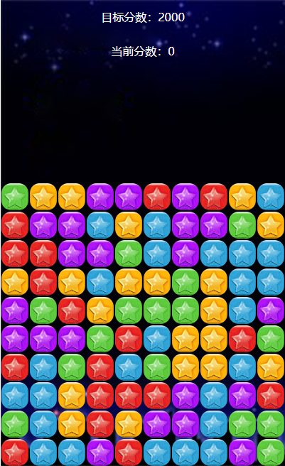

# PopStar
可闯关的消灭星星小游戏，使用如下
````javascript
new PopStar()
````
游戏截图如下  
  
游戏可通过以下全局配置进行自定义
````javascript
let config = {
        //小星星的宽高
        squareWidth: 40,
        squareHeight: 40,
        squareSet: [],//存储小星星的二维数组
        tableRows: 10,//行数
        baseScore: 5,//每一个小星星的基础分数
        stepScore: 10,//每一个小星星的递增分数
        targetScore: 2000,//目标分数，初始为2000
        el: document.getElementsByClassName('pop_star')[0]
    };
````
